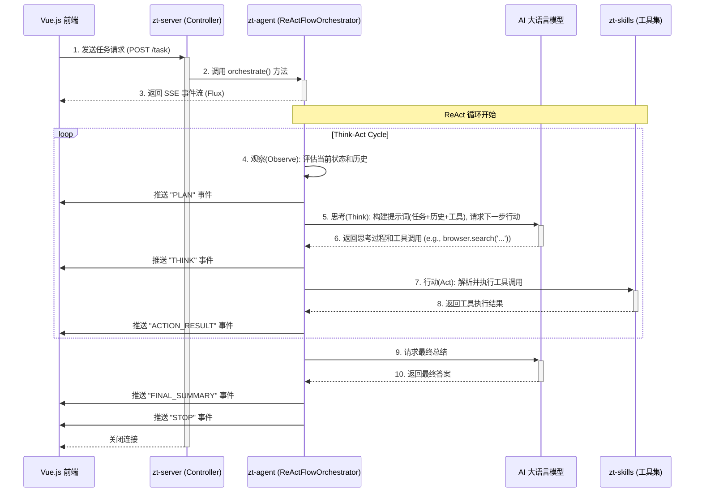

<p align="center">
	
</p>
<h1 align="center" style="margin: 30px 0 30px; font-weight: bold;">智瞳AI · 后端</h1>
<h4 align="center">一个基于 Spring AI 和 ReAct 模式构建，具有“思考-行动-观察”能力的智能代理后端服务。</h4>

---

## 核心架构

智瞳AI后端采用模块化的微服务架构，基于 `Spring Boot 3` 和 `Spring AI` 构建，实现了响应式的、事件驱动的 AI 代理服务。

### 架构图

```mermaid
graph TD
    subgraph 用户端 (Client)
        A[Vue.js 前端]
    end

    subgraph 后端服务 (zt-ai)
        B(zt-server) -- REST/SSE --> A
        B -- 调用 --> C{zt-agent}
        C -- 使用 --> D[zt-common]
        C -- 调用 --> E[zt-skills]
        C -- 访问 --> F[Spring AI]
        F -- 对话 --> G[AI模型 e.g. Tongyi]
        E -- 执行 --> H[工具集 e.g. Playwright, Shell]
        B -- 读/写 --> I[MySQL]
        C -- 读/写 --> J[Redis]
    end

    style B fill:#f9f,stroke:#333,stroke-width:2px
    style C fill:#ccf,stroke:#333,stroke-width:2px
    style E fill:#cfc,stroke:#333,stroke-width:2px
```

### 模块职责

- **`zt-server`**: **Web服务层**
  - 基于 `Spring WebFlux` 构建，提供响应式的HTTP接口。
  - `ChatController` 暴露SSE（Server-Sent Events）端点，用于与前端进行实时的、单向的事件流通信。
  - 负责用户认证、会话管理（增删改查）以及与数据库的交互。
  - 技术栈: Spring WebFlux, Spring Security, MySQL, Mybatis-Plus。

- **`zt-agent`**: **智能代理核心**
  - 实现了 **ReAct (Reason + Act)** 模式的核心逻辑。
  - `ReActFlowOrchestrator` 是流程编排器，负责管理整个 "观察 -> 思考 -> 行动" 的循环。
  - `AgentExecutionContext` 维护了单次任务执行的完整上下文，包括记忆、可用工具等。
  - 通过 `Spring AI` 与底层大语言模型（LLM）进行交互。
  - 使用 **Redis** 进行会话状态管理和记忆存储，以支持断线重连和流程恢复。
  - 技术栈: Project Reactor, Spring AI, Redis。

- **`zt-skills`**: **代理技能（工具）层**
  - 定义和管理代理可以使用的各种“技能”或“工具”。
  - 技能被设计为可插拔的模块，在 `resources/skills` 目录中通过 Markdown 文件进行定义。
  - `AgentSkills` 负责加载和提供这些技能的元数据给 `zt-agent`，以便在生成提示词时告知LLM它有哪些可用的工具。
  - 示例工具:
    - **BrowserSkill**: 使用 `Playwright` 进行网页浏览、内容提取等。
    - **ShellSkill**: 执行Shell命令。
    - **FileStorageTools**: 读写文件。

- **`zt-common`**: **通用模块**
  - 存放整个项目共享的数据结构（DTO, VO, Enums）、常量、工具类和自定义异常。

## 业务执行流程

智瞳AI的核心是其 **ReAct 任务执行流程**，它赋予了AI独立“思考”并利用工具解决复杂问题的能力。

### ReAct 流程顺序图



### 流程详解

1.  **任务发起**: 用户在前端输入任务，选择 "ReAct模式" 并发送。前端向 `zt-server` 的 `/public/agent/task` 接口发起一个HTTP POST请求。
2.  **流程编排**: `ChatController` 调用 `ReActFlowOrchestrator` 的 `orchestrate` 方法，并立即向前端返回一个响应式的 `Flux` 事件流。这使得前端可以立刻开始监听后续事件。
3.  **异步执行**: `ReActFlowOrchestrator` 在独立的线程池 (`Scheduler`) 中异步开始执行 ReAct 循环。
4.  **观察 (Observe)**: 在每个循环开始时，系统会评估当前任务的完成情况和历史步骤，决定下一步的目标。
5.  **思考 (Think)**: Orchestrator 会构建一个复杂的提示词（Prompt），包含原始任务、历史对话、之前的 "思考-行动" 步骤以及一份详细的 **可用工具清单**（来自 `zt-skills`）。然后，它将这个提示词发送给大语言模型（LLM）。LLM 的职责是生成下一步的“思考”过程和要执行的“行动”（通常是一个JSON格式的工具调用）。
6.  **行动 (Act)**: Orchestrator 解析LLM返回的工具调用指令，并从 `zt-skills` 中找到对应的工具并执行。例如，如果指令是浏览网页，它就会调用 `Playwright` 工具。
7.  **事件推送**: 在 "思考" 和 "行动" 的每一步，Orchestrator 都会通过SSE通道向前端推送一个结构化的事件（`ReActEventVo`），包含了当前步骤的类型（`THINK`, `ACTION_RESULT` 等）和具体数据。前端据此实时渲染出AI的思考过程和行动结果。
8.  **循环与终止**: 这个 "观察-思考-行动" 的循环会持续进行，直到LLM认为任务已经完成并输出最终答案，或者达到预设的最大步数限制。
9.  **完成**: Orchestrator 将最终总结推送给前端，并发送一个特殊的 `STOP` 事件来告知流程结束。

## 如何运行

1.  **环境准备**:
    - Java 17
    - Maven 3.8+
    - MySQL 8.0+
    - Redis
2.  **配置**:
    - 修改 `zt-server/src/main/resources/application.yml` 文件，配置数据库、Redis以及Spring AI相关的大模型API Key。
3.  **启动**:
    - 在项目根目录运行 `mvn clean install`。
    - 运行 `zt-server` 模块下的 `ReActAgentApplication.java` 的 `main` 方法启动项目。
